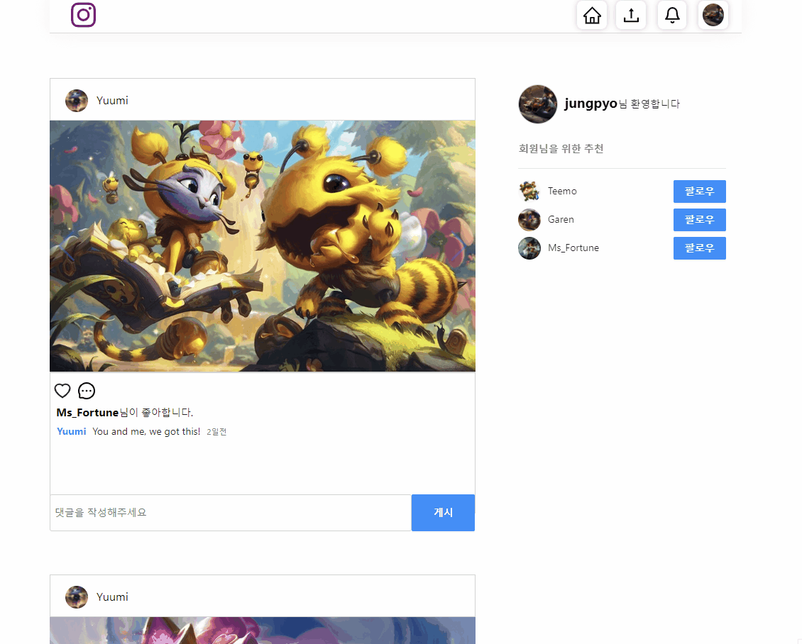

# 인스타그램 클론코딩

> John Ahn님의 [boilerplate-mern-stack](https://github.com/jaewonhimnae/boilerplate-mern-stack)을 기반으로 제작한 인스타그램 클론코딩 프로젝트입니다.

## 사용한 스택

> MongoDB
> Express
> React
> Node

## 기능 설명

1. 회원가입
    
   

2. 로그인
    
   

3. 회원정보수정
    
   

4. 포스트작성
    
   

5. 랜딩페이지: 추천유저 팔로우
    
   

6. 랜딩페이지: 팔로우한 유저의 포스트 조회
    
   

7. 팔로우한 유저 포스트에 좋아요와 댓글남기기
    
   

8. 유저페이지 기능
    
   

9. 포스트디테일
    
   

10. 댓글 알림기능
     
    
